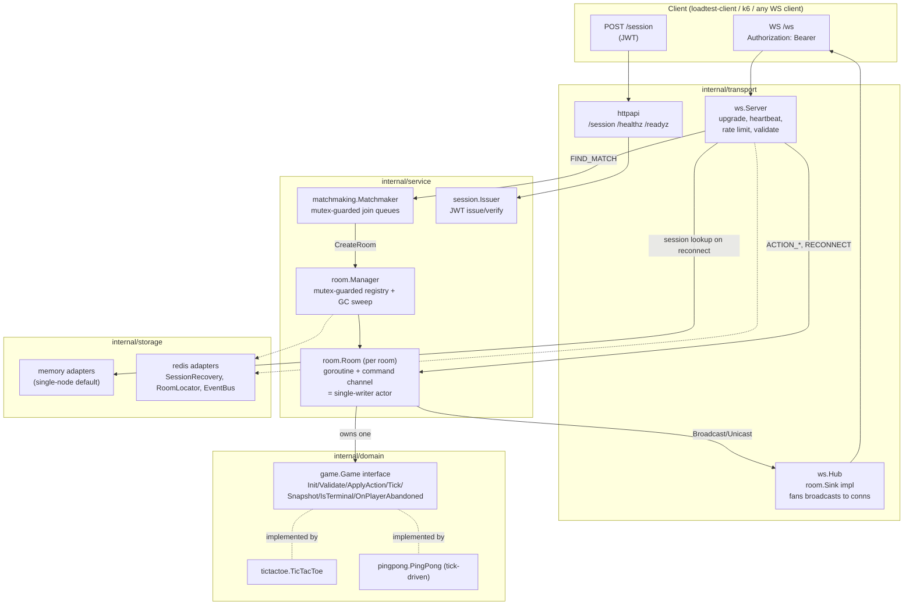

# realtime-engine

An authoritative, real-time multiplayer state synchronization engine written in Go.

The server owns all game state. Clients only ever send intents (`ACTION_MOVE`,
`ACTION_BUZZ`, and so on), and the server validates them, applies them, and
broadcasts the resulting diffs back out. Matchmaking, disconnect/reconnect
with a grace window, rate limiting, and multi-node coordination via Redis
are all generic. Tic-tac-toe (plus a second toy game, a reflex buzzer) is
just a plugin behind a `Game` interface, not something baked into the engine.

This project is backend-only on purpose, there's no browser client. Check out
[`cmd/loadtest-client`](#running-it) for a scripted CLI client, and
[`test/integration`](test/integration) for automated end-to-end tests that
run over real WebSocket connections.

## Architecture



**Concurrency model.** Each `Room` runs on its own goroutine, reading commands
one at a time off a channel (the "actor" pattern). Every join, action,
disconnect, and tick for that room gets processed in order on that one
goroutine, so `Game` implementations never have to worry about thread
safety themselves. The `room.Manager` registry (basically, which rooms
exist right now) is handled separately with a plain `sync.RWMutex`-guarded
map. That's a deliberate split: short, read-heavy registry lookups use a
plain mutex, while anything that touches actual game state goes through
the actor. More detail lives in the package doc in
[`internal/service/room/room.go`](internal/service/room/room.go).

**Horizontal scaling.** With `REDIS_ADDR` set, each room grabs a lease
(`room:{id}:owner`, renewed every `LeaseTTL/3`) so exactly one node runs
that room's actor at a time. The renewal is self-healing too: if a renewal
gets missed, the node just re-acquires the lease instead of losing the room
for good. Player sessions get recorded in Redis as well
(`session:{id}`, with a TTL matching the grace window), so if a reconnect
lands on a *different* node, that node can send back a `REDIRECT` pointing
to whichever node actually owns the room. The engine doesn't try to tunnel
WebSocket traffic between nodes itself, that's a deliberate scope tradeoff.
See [`internal/storage/redis`](internal/storage/redis) for the details.

## Directory layout

```
cmd/
  server/              entrypoint: wires internal/app, starts HTTP+WS listener
  loadtest-client/      scripted CLI WS client for manual smoke-testing
internal/
  app/                  wires every layer into one http.ServeMux (shared by
                         cmd/server and test/integration, so they run the
                         exact same stack)
  config/                env-based configuration with defaults
  domain/
    game/                the generic Game interface + Registry, engine-agnostic
    tictactoe/            turn-based reference implementation
    pingpong/              tick-driven reflex-buzzer implementation (proves the
                         abstraction isn't secretly tictactoe-shaped)
  service/
    room/                 the concurrency core: per-room actor + Manager registry + GC
    matchmaking/          thread-safe join-queue matchmaker
    session/               JWT issue/verify
  storage/
    storage.go            SessionRecovery / RoomLocator / EventBus interfaces
    memory/                 single-node in-memory adapters (default)
    redis/                   multi-node Redis adapters
  transport/
    ws/                    WebSocket transport: upgrade, heartbeat, envelope,
                         rate limiting, validation, the Hub (room.Sink impl)
    httpapi/               POST /session, /healthz, /readyz
  ratelimit/              generic token-bucket limiter
test/
  integration/            end-to-end tests over real WebSocket connections
  loadtest/                k6 script + results
deploy/docker/            Dockerfile + docker-compose.yml
```

## Running it

```sh
go run ./cmd/server                       # single node, in-memory storage
REDIS_ADDR=localhost:6379 go run ./cmd/server   # multi-node-capable

# or the full stack:
docker compose -f deploy/docker/docker-compose.yml up -d
```

Want to actually watch a game play out? Open two terminals:

```sh
go run ./cmd/loadtest-client -addr http://localhost:8080 -player alice
go run ./cmd/loadtest-client -addr http://localhost:8080 -player bob
```

### Configuration

Everything is set through environment variables (see
`internal/config/config.go` for the defaults): `HTTP_ADDR`, `NODE_ID`,
`JWT_SECRET`, `SESSION_TTL`, `GRACE_DURATION`, `TICK_INTERVAL`,
`FINISHED_LINGER`, `WAITING_TTL`, `GC_INTERVAL`, `PING_INTERVAL`,
`PONG_TIMEOUT`, `RATE_LIMIT_CAPACITY`, `RATE_LIMIT_REFILL`, `REDIS_ADDR`,
and `LEASE_TTL`.

## Testing

```sh
go test ./...                    # unit + integration (real WebSocket connections)
go test -race -count=5 ./...     # with the race detector (needs cgo, see below)
```

The race detector needs a real C toolchain. If your machine doesn't have one
set up (Windows without mingw-w64, for example), just run it in Docker
instead:

```sh
docker run --rm -v "$(pwd):/src" -w /src golang:1.24 go test -race -count=5 ./...
```

A quick tour of what's covered:

- `internal/domain/*`: table-driven game-rule tests (every win line, draws,
  illegal moves), plus a generic conformance suite
  (`internal/domain/game/conformance_test.go`) that runs against every
  registered `Game`. That way the interface gets proven out against two
  structurally different games, not just tic-tac-toe.
- `internal/service/room`: concurrency tests under `-race`, including
  concurrent `Join` calls respecting room capacity, concurrent
  `Disconnect`/`Reconnect` racing the grace-window timer, and a GC sweep
  test with an injectable `Clock` so it doesn't need real sleeps.
- `test/integration`: a full two-player game, invalid-action rejection,
  heartbeat-timeout-triggers-forfeit, and reconnect-within-grace-window,
  all driven over real `gorilla/websocket` client connections against an
  `httptest.Server` running the actual production wiring.

## Load testing

See [`test/loadtest/README.md`](test/loadtest/README.md) for how to run the
k6 script, and [`test/loadtest/results/BENCHMARKS.md`](test/loadtest/results/BENCHMARKS.md)
for real results from actually running it. The headline number:
**2,200 concurrent WebSocket connections (about 1,100 concurrently active
rooms) held steady with p95 action latency around 1ms and p99 around 3ms**,
with under 340 MiB of server memory used, measured by running the script
against this repo's own `docker-compose.yml` stack.

## Protocol

### Auth

`POST /session` returns `{playerId, sessionId, token, expiresAt}`. Connect
to `GET /ws` with `Authorization: Bearer <token>`. The token stays valid
for the whole logical session and never rotates, so reconnecting within the
grace window just means reconnecting with that same token.

### Envelope

Client to server:

```jsonc
{ "type": "ACTION_MOVE", "seq": 42, "ts": 1755678900123, "payload": {"x":1,"y":2} }
```

Server to client:

```jsonc
{
  "type": "STATE_DIFF",       // | STATE_SNAPSHOT | ROOM_STARTED | PLAYER_JOINED
                               // | PLAYER_DISCONNECTED | PLAYER_RECONNECTED
                               // | ROOM_CLOSED | ERROR | REDIRECT
  "roomId": "01J...",
  "serverSeq": 1007,          // monotonic per room
  "ackPlayer": "alice",       // which player's action produced this diff
  "diff": { "cell": {"x":1,"y":2,"mark":"X"}, "turn": "bob" },
  "snapshot": { ... },        // present on STATE_SNAPSHOT/ROOM_STARTED only
  "terminal": false,
  "winner": "alice",          // present when terminal
  "error": {"code":"NOT_YOUR_TURN","message":"..."},
  "redirectAddr": "ws://other-node:8080/ws"
}
```

There are two client-sent control types besides game actions: `FIND_MATCH`
(payload `{"gameType":"tictactoe"}`) and `RESYNC` (no payload needed, it
just asks for a fresh `STATE_SNAPSHOT`, useful after noticing a gap in
`serverSeq`).

### Sequencing and idempotency

Each player's `seq` has to strictly increase. A duplicate or stale `seq`
gets rejected with `STALE_OR_DUPLICATE_SEQ` instead of being applied again,
which makes it safe for a client to retry a send it wasn't sure got through.

### Disconnect and reconnect

A disconnect (heartbeat timeout, or the connection just closing) starts a
`GRACE_DURATION` timer for that player, 30 seconds by default. Reconnecting
with the same bearer token before that timer runs out resumes the room and
sends back a fresh `STATE_SNAPSHOT`. If the timer does run out,
`Game.OnPlayerAbandoned` decides what happens next (tic-tac-toe just
declares the remaining player the winner).

### Rate limiting and validation

Each connection gets its own token bucket (capacity 20, refilling at 10/s
by default). That was chosen over a sliding-window log because it allows
short, legitimate bursts, real player input tends to be bursty, while
still only costing O(1) memory and O(1) work per check. Structural
validation (message size, a required `type` field, payload size) happens
at the transport boundary before a `game.Action` even gets constructed.
Game-rules validation (`ErrNotYourTurn`, `ErrIllegalMove`, and so on)
happens later, inside the room actor, via `Game.Validate`.

## Adding a new game

Implement `game.Game` (see `internal/domain/game/game.go`) and register it:

```go
registry.Register("my-game", mygame.New)
```

Nothing in `service/` or `transport/` needs to change. Take a look at
`internal/domain/pingpong` for a second example that's structurally
different from tic-tac-toe (tick-driven instead of purely turn-based).
