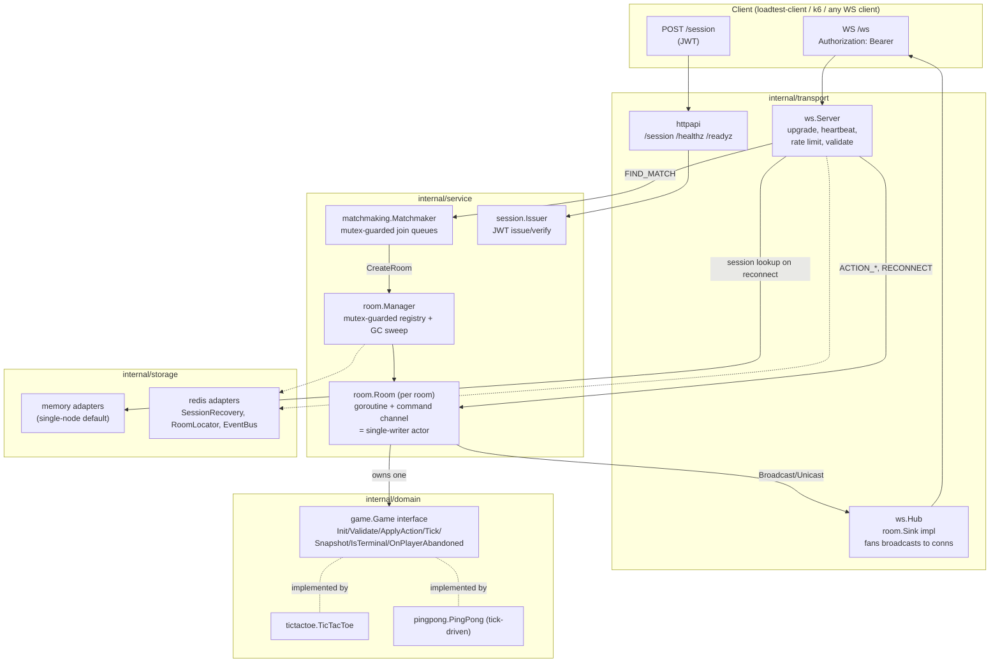

# realtime-engine

An authoritative, real-time multiplayer state synchronization engine in Go.
The server owns all game state; clients send only intents (`ACTION_MOVE`,
`ACTION_BUZZ`, ...) and the server validates, applies, and broadcasts
authoritative diffs. Matchmaking, disconnect/reconnect with a grace window,
rate limiting, and multi-node coordination via Redis are all generic —
tic-tac-toe (and a second toy game, a reflex buzzer) are just plugins
behind a `Game` interface, not special-cased into the engine.

This project is backend-only by design: there is no browser client. See
[`cmd/loadtest-client`](#cmdloadtest-client) for a scripted CLI client, and
[`test/integration`](test/integration) for automated end-to-end coverage
over real WebSocket connections.

## Architecture



**Concurrency model:** each `Room` runs one goroutine reading a serialized
command channel — the "actor" pattern. Every join, action, disconnect, and
tick for that room is processed one at a time on that goroutine, so
`Game` implementations never need to be thread-safe themselves. The
`room.Manager` registry (which rooms exist) is a separate, ordinary
`sync.RWMutex`-guarded map — a deliberate hybrid: short, read-heavy
registry operations use a plain mutex; anything touching actual game state
goes through the actor. See the package doc in
[`internal/service/room/room.go`](internal/service/room/room.go).

**Horizontal scaling:** with `REDIS_ADDR` set, each room acquires a
lease (`room:{id}:owner`, renewed at `LeaseTTL/3`, self-healing — a missed
renewal triggers a re-acquire rather than permanently losing the room) so
exactly one node runs a given room's actor. Player sessions are recorded in
Redis (`session:{id}`, TTL = grace window) so a reconnect landing on a
*different* node gets a `REDIRECT` to the node that actually owns the room,
rather than the engine attempting to tunnel WebSocket traffic between
nodes — a deliberate scope tradeoff, see
[`internal/storage/redis`](internal/storage/redis).

## Directory layout

```
cmd/
  server/              entrypoint: wires internal/app, starts HTTP+WS listener
  loadtest-client/      scripted CLI WS client for manual smoke-testing
internal/
  app/                  wires every layer into one http.ServeMux (shared by
                         cmd/server and test/integration, so they run the
                         exact same stack)
  config/                env-based configuration with defaults
  domain/
    game/                the generic Game interface + Registry — engine-agnostic
    tictactoe/            turn-based reference implementation
    pingpong/              tick-driven reflex-buzzer implementation (proves the
                         abstraction isn't secretly tictactoe-shaped)
  service/
    room/                 the concurrency core: per-room actor + Manager registry + GC
    matchmaking/          thread-safe join-queue matchmaker
    session/               JWT issue/verify
  storage/
    storage.go            SessionRecovery / RoomLocator / EventBus interfaces
    memory/                 single-node in-memory adapters (default)
    redis/                   multi-node Redis adapters
  transport/
    ws/                    WebSocket transport: upgrade, heartbeat, envelope,
                         rate limiting, validation, the Hub (room.Sink impl)
    httpapi/               POST /session, /healthz, /readyz
  ratelimit/              generic token-bucket limiter
test/
  integration/            end-to-end tests over real WebSocket connections
  loadtest/                k6 script + results
deploy/docker/            Dockerfile + docker-compose.yml
```

## Running it

```sh
go run ./cmd/server                       # single node, in-memory storage
REDIS_ADDR=localhost:6379 go run ./cmd/server   # multi-node-capable

# or the full stack:
docker compose -f deploy/docker/docker-compose.yml up -d
```

Play a game from the CLI (two terminals):

```sh
go run ./cmd/loadtest-client -addr http://localhost:8080 -player alice
go run ./cmd/loadtest-client -addr http://localhost:8080 -player bob
```

### Configuration

All via environment variables (see `internal/config/config.go` for
defaults): `HTTP_ADDR`, `NODE_ID`, `JWT_SECRET`, `SESSION_TTL`,
`GRACE_DURATION`, `TICK_INTERVAL`, `FINISHED_LINGER`, `WAITING_TTL`,
`GC_INTERVAL`, `PING_INTERVAL`, `PONG_TIMEOUT`, `RATE_LIMIT_CAPACITY`,
`RATE_LIMIT_REFILL`, `REDIS_ADDR`, `LEASE_TTL`.

## Testing

```sh
go test ./...                    # unit + integration (real WebSocket connections)
go test -race -count=5 ./...     # with the race detector (needs cgo; see below)
```

The race detector needs a real C toolchain. If your host doesn't have one
(e.g. Windows without mingw-w64), run it in Docker instead:

```sh
docker run --rm -v "$(pwd):/src" -w /src golang:1.24 go test -race -count=5 ./...
```

- `internal/domain/*`: table-driven game-rule tests (all win lines, draws,
  illegal moves) plus a generic conformance suite
  (`internal/domain/game/conformance_test.go`) run against every registered
  `Game`, so the interface is proven against two structurally different
  games, not just tic-tac-toe.
- `internal/service/room`: concurrency tests under `-race` — concurrent
  `Join` respecting room capacity, concurrent `Disconnect`/`Reconnect`
  racing the grace-window timer, GC sweep with an injectable `Clock` (no
  real sleeps).
- `test/integration`: a full 2-player game, invalid-action rejection,
  heartbeat-timeout-triggers-forfeit, and reconnect-within-grace-window —
  all driven over real `gorilla/websocket` client connections against an
  `httptest.Server` running the actual production wiring.

## Load testing

See [`test/loadtest/README.md`](test/loadtest/README.md) for how to run the
k6 script, and [`test/loadtest/results/BENCHMARKS.md`](test/loadtest/results/BENCHMARKS.md)
for real results. Headline number: **2,200 concurrent WebSocket connections
(~1,100 concurrently active rooms) sustained with p95 action latency ~1ms
and p99 ~0ms**, negligible server CPU/memory, measured by actually running
the script against this repo's own `docker-compose.yml` stack.

## Protocol

### Auth

`POST /session` → `{playerId, sessionId, token, expiresAt}`. Connect to
`GET /ws` with `Authorization: Bearer <token>`. The token is stable for the
whole logical session (no rotation); reconnecting within the grace window
means simply reconnecting with the same token.

### Envelope

Client → server:

```jsonc
{ "type": "ACTION_MOVE", "seq": 42, "ts": 1755678900123, "payload": {"x":1,"y":2} }
```

Server → client:

```jsonc
{
  "type": "STATE_DIFF",       // | STATE_SNAPSHOT | ROOM_STARTED | PLAYER_JOINED
                               // | PLAYER_DISCONNECTED | PLAYER_RECONNECTED
                               // | ROOM_CLOSED | ERROR | REDIRECT
  "roomId": "01J...",
  "serverSeq": 1007,          // monotonic per room
  "ackPlayer": "alice",       // which player's action produced this diff
  "diff": { "cell": {"x":1,"y":2,"mark":"X"}, "turn": "bob" },
  "snapshot": { ... },        // present on STATE_SNAPSHOT/ROOM_STARTED only
  "terminal": false,
  "winner": "alice",          // present when terminal
  "error": {"code":"NOT_YOUR_TURN","message":"..."},
  "redirectAddr": "ws://other-node:8080/ws"
}
```

Two client-sent control types beyond game actions: `FIND_MATCH` (payload
`{"gameType":"tictactoe"}`) and `RESYNC` (no payload — requests a fresh
`STATE_SNAPSHOT`, e.g. after detecting a `serverSeq` gap).

### Sequencing & idempotency

Each player's `seq` must strictly increase; a duplicate or stale `seq` is
rejected with `STALE_OR_DUPLICATE_SEQ` rather than applied twice — safe
against a client retrying a send it wasn't sure was received.

### Disconnect / reconnect

Disconnect (heartbeat timeout or transport close) starts a
`GRACE_DURATION` (default 30s) timer for that player; a reconnect with the
same bearer token before it expires resumes the room and sends a fresh
`STATE_SNAPSHOT`. If it expires, `Game.OnPlayerAbandoned` decides the
outcome (tic-tac-toe declares the remaining player the winner).

### Rate limiting & validation

Token bucket per connection (default capacity 20, refill 10/s) — chosen
over a sliding-window log because it allows short legitimate bursts (real
player input is bursty) at O(1) memory/check. Structural validation
(message size, required `type` field, payload size) happens at the
transport boundary before a `game.Action` is ever constructed; game-rules
validation (`ErrNotYourTurn`, `ErrIllegalMove`, ...) happens inside the
room actor via `Game.Validate`.

## Adding a new game

Implement `game.Game` (see `internal/domain/game/game.go`) and register it:

```go
registry.Register("my-game", mygame.New)
```

Nothing in `service/` or `transport/` needs to change — see
`internal/domain/pingpong` for a second, structurally different example
(tick-driven rather than purely turn-based).
